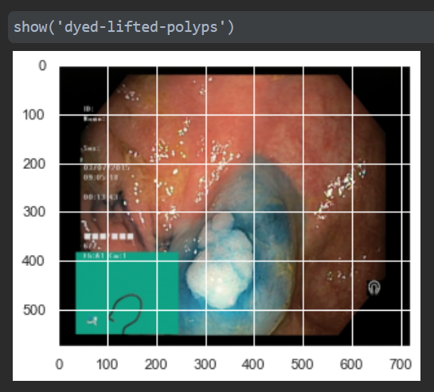
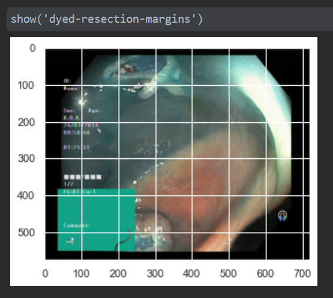
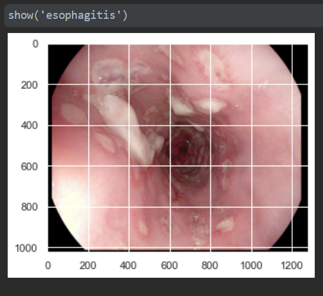
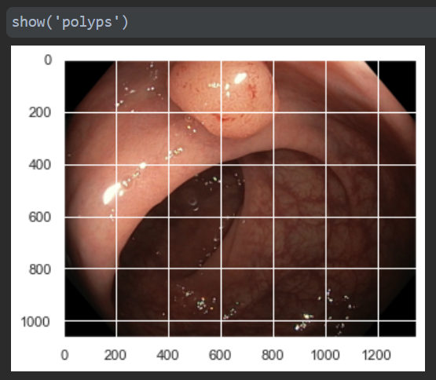
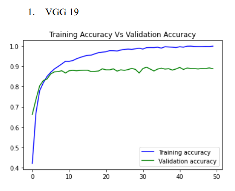
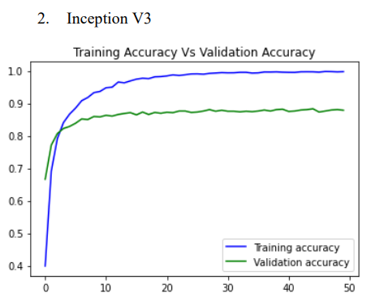
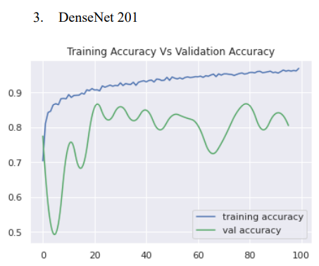

# Predicting Anomalies In the GI track using KVISAR Dataset

Below is a summary of the results we obtained for the task please refer to the [final report](FinalReport.pdf) 

###A look at the dataset

| | |
| ----------- | ----------- |
|      |    |
|   |    |

###Models and prediction results obtained.
We mainly used 3 models for experimentation.

* VGG19
* InceptionV3
* DenseNet201

| | |
| ----------- | ----------- |
|      |    |
|   |

###Result summary
 

